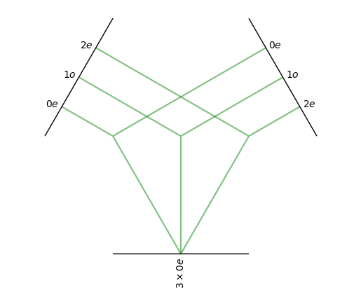

# T03-MACE-Theory

## Spherical Harmonics as the Angular Embedding $Y_l^m$


* **Spherical Harmonics** $Y_\ell^m(\hat{\mathbf{r}})$
* **Group Theory of SO(3)** (rotations in 3D)
* **Wigner D-matrices** $D_{mm'}^{(\ell)}(R)$

---

### 🎯 What Are Spherical Harmonics?

Spherical harmonics $Y_\ell^m(\theta, \phi)$ are special functions defined on the **unit sphere** $S^2$. They're indexed by two numbers:

* $\ell$: **degree** (non-negative integer)
* $m \in [-\ell, \ell]$: **order**

They arise naturally as the **angular part** of the solution to Laplace’s equation in spherical coordinates, and they form a **complete orthonormal basis** on the sphere:

$$
f(\hat{\mathbf{r}}) = \sum_{\ell=0}^{\infty} \sum_{m=-\ell}^{\ell} c_{\ell m} Y_\ell^m(\hat{\mathbf{r}})
$$

---

### 🔄 Rotation Behavior (Group Theory)

The crucial property that makes $Y_\ell^m$ ideal for MACE is **how they transform under rotations** $R \in \text{SO}(3)$:

$$
Y_\ell^m(R \hat{\mathbf{r}}) = \sum_{m'=-\ell}^{\ell} D_{mm'}^{(\ell)}(R)^* Y_\ell^{m'}(\hat{\mathbf{r}})
$$

Here:

* $D^{(\ell)}(R) \in \mathbb{C}^{(2\ell + 1) \times (2\ell + 1)}$ is the **Wigner D-matrix** — a unitary representation of SO(3).
* This tells us that the set $\{Y_\ell^m\}_{m=-\ell}^\ell$ **transforms linearly** under rotation — they form a **basis for the $(2\ell+1)$-dimensional irreducible representation** of SO(3).

This means the angular part of atomic interactions can be represented using these basis functions and still **preserve equivariance**.

#### 🔢 Part 1: Define spherical harmonics up to $\ell = 2$

```python
spherical_harmonics = o3.SphericalHarmonics([0, 1, 2], True)
```

This uses **`e3nn.o3.SphericalHarmonics`**, which:

* Prepares real-valued spherical harmonics up to degree $\ell = 2$
* `True` specifies **normalization** to orthonormal basis
* Internally, this creates a callable that evaluates:

  $$
  Y_0^0,\quad Y_1^{-1}, Y_1^0, Y_1^1,\quad Y_2^{-2}, \dots, Y_2^2
  $$
* Total number of terms:

  $$
  \sum_{\ell=0}^2 (2\ell + 1) = 1 + 3 + 5 = \boxed{9}
  $$

---

#### 🔍 Part 2: Evaluate $Y_\ell^m(\hat{\mathbf{r}})$

```python
vector = torch.tensor([1.0, 0.2, 0.75])
print(spherical_harmonics(vector))
```

This computes:

$$
\{Y_\ell^m(\hat{\mathbf{r}})\}_{\ell=0}^2
\quad\text{with }\hat{\mathbf{r}} = \frac{[1.0,\ 0.2,\ 0.75]}{\|\cdot\|}
$$

The result is a **9-element vector** storing all $Y_\ell^m$ values flattened in the canonical order:

$$
[Y_0^0,\ Y_1^{-1}, Y_1^0, Y_1^1,\ Y_2^{-2}, Y_2^{-1}, Y_2^0, Y_2^1, Y_2^2]
$$

These form a **spherical tensor** under SO(3): they transform among themselves when the input vector rotates.

---

#### 🔁 Part 3: Rotate the vector around an axis and track how $Y_\ell^m$ changes

```python
# rotate around [0, 0.7071, 0.7071]
rotation_matrix = Rotation.from_rotvec(i * angle * axis).as_matrix()
rotated_vector = R @ original_vector
```

This creates **360 rotated versions** of the original vector along a 3D rotation axis $\mathbf{u} = \frac{1}{\sqrt{2}}(0,1,1)$, simulating a **full 360° rotation in SO(3)**.

---

#### 🧮 Part 4: Apply spherical harmonics to each rotated vector

```python
spherical_harmonic_values = spherical_harmonics(rotated_vectors)
```

Each row of the result contains:

$$
[Y_0^0(\hat{\mathbf{r}}'), \dots, Y_2^2(\hat{\mathbf{r}}')]
\quad\text{for one rotated input vector}
$$

So the full output shape is:

$$
(360,\ 9) \quad\text{(360 angles × 9 harmonic components)}
$$

---

#### 📈 Part 5: Plot the variation

```python
plt.plot(spherical_harmonic_values.numpy(), label=labels)
```

* Each line on the plot corresponds to one $Y_\ell^m$
* You will see **oscillatory patterns**, depending on $m$
* For example, $Y_1^1 \sim e^{i\phi}$, so its **phase wraps** as $\phi$ increases
* This illustrates the core equivariance property:

  $$
  Y_\ell^m(R\hat{\mathbf{r}}) = \sum_{m'} D_{mm'}^{(\ell)}(R)^* Y_\ell^{m'}(\hat{\mathbf{r}})
  $$

  So the harmonics "rotate" among themselves — which is what you're seeing in the changing values.


The key points to note are that the $l=0$ component is constant - it does not change when the vector is rotated.  The other components do change, and as $l$ increases the frequency of the features increases.

#### ⁉️ What does $m$ represents ?
Absolutely — here’s a cleaner, more concise version of your notes, preserving all the key ideas while making it easier to scan and remember:

* $\ell$: **degree** — controls the angular resolution (like frequency).
* $m \in [-\ell, \ell]$: **order** — controls variation in the azimuthal angle $\phi$ (around the z-axis).

You always get $2\ell + 1$ values of $m$ for each $\ell$.

1. **Azimuthal frequency**

   * $m = 0$: symmetric about z-axis
   * $m = 1$: 1 oscillation around φ
   * Higher $|m|$ → more angular variation

2. **Angular momentum** (QM)

   * $m$: z-component of angular momentum

3. **Basis label in SO(3) irreps**

   * Each $m$ is one component in a $(2\ell+1)$-dim SO(3) representation
   * Transforms under Wigner $D^{(\ell)}$ matrices

**🧮 Example: $\ell = 1$**

| $m$ | Harmonic                       | Meaning        |
| --- | ------------------------------ | -------------- |
| -1  | $\sim \sin\theta\, e^{-i\phi}$ | rotates in φ   |
| 0   | $\sim \cos\theta$              | symmetric in φ |
| +1  | $\sim \sin\theta\, e^{+i\phi}$ | rotates in φ   |

* $m = 0$: rotation-invariant around z
* $m = \pm1$: varies with azimuth — you see these oscillate in the plot

---

### 🔗 In MACE: Angular Embedding via $Y_\ell^m$

In MACE, for a pair of atoms $i, j$, the model uses:

* Relative vector: $\mathbf{r}_{ij} = \mathbf{r}_j - \mathbf{r}_i$
* Unit vector: $\hat{\mathbf{r}}_{ij} = \mathbf{r}_{ij} / \|\mathbf{r}_{ij}\|$
* **Angular embedding**: evaluates $Y_\ell^m(\hat{\mathbf{r}}_{ij})$ for a fixed $\ell$


## Getting Invariant Quantities with `e3nn`

### 📘 Theoretical Foundations

MACE uses **O(3)-equivariant message passing**, where internal node features are structured as:

$$
h_{i,kLM}^{(t)} \in \mathbb{R}^{(2L + 1)}
$$

* $t$: Layer index (depth)
* $k$: Channel index (number of copies of an irrep)
* $L$: Angular momentum (0=scalar, 1=vector, 2=rank-2 tensor, etc.)
* $M \in [-L, L]$: Component index

These features transform under a rotation $Q \in O(3)$ via a **Wigner D-matrix**:

$$
h_{i,kLM}^{(t)}(Q \cdot \{r_j\}) = \sum_{M'} D^{(L)}_{M'M}(Q) \, h_{i,kLM'}^{(t)}(\{r_j\})
\tag{6 from paper}
$$

---

### 🔧 How Tensor Products Build Equivariant Features

To construct new equivariant features from existing ones, MACE uses **Clebsch–Gordan tensor products**:

$$
\text{irrep}^{(L_1)} \otimes \text{irrep}^{(L_2)} \rightarrow \bigoplus_{L=|L_1 - L_2|}^{L_1 + L_2} \text{irrep}^{(L)}
$$

This forms the core of the message function $M_t(\cdot)$ and update function $U_t(\cdot)$ in the message passing:

| Equation                                                                              | Description                     |
| ------------------------------------------------------------------------------------- | ------------------------------- |
| $m_i^{(t)} = \bigoplus_{j \in \mathcal{N}(i)} M_t(\sigma_i^{(t)}, \sigma_j^{(t)})$    | Message construction (Eq. 2)    |
| $h_i^{(t+1)} = U_t(\sigma_i^{(t)}, m_i^{(t)})$                                        | Feature update (Eq. 3)          |
| $h_{i,kLM}^{(t)}(Q\cdot \{r_j\}) = \sum_{M'} D_{M'M}^{(L)}(Q) \cdot h_{i,kLM'}^{(t)}$ | Rotation transformation (Eq. 6) |

---

### 💻 Corresponding Code Implementation

```python
tensor_product = o3.FullyConnectedTensorProduct(
    irreps_in1=o3.Irreps("1x0e + 1x1o + 1x2e"),
    irreps_in2=o3.Irreps("1x0e + 1x1o + 1x2e"),
    irreps_out=o3.Irreps("3x0e"),
    internal_weights=False
)
```

| Code Element             | Meaning                                                                                  |
| ------------------------ | ---------------------------------------------------------------------------------------- |
| `1x0e`                   | One scalar channel (L=0, even parity)                                                    |
| `1x1o`                   | One vector channel (L=1, odd parity)                                                     |
| `1x2e`                   | One rank-2 tensor channel (L=2, even parity)                                             |
| Tensor product           | Combines pairs like $1 \otimes 1$, $2 \otimes 2$, etc., projecting to $L=0$ output       |
| `3x0e` output            | The result is **3 invariant scalars** (often used for energy readout or scalar coupling) |
| `internal_weights=False` | No automatic learning — weights must be explicitly defined or tested for analysis        |

---

### 🧮 Intuition and Visualization

* You're forming all valid $L_1 \otimes L_2 \to L=0$ combinations
* This produces rotation-invariant outputs from rotation-equivariant inputs
* `.visualize()` shows the **Clebsch–Gordan paths** (e.g., $1 \otimes 1 \to 0$, $2 \otimes 2 \to 0$)




### 🔀 Left and right branches:

* These are the **input irreps**:

  * Left: $0e$, $1o$, $2e$ from `irreps_in1`
  * Right: $0e$, $1o$, $2e$ from `irreps_in2`

### 🌿 Middle connections:

* Each green **branch pair** shows a **valid tensor product path**:

  * e.g., $1o \otimes 1o \rightarrow 0e$
  * e.g., $2e \otimes 2e \rightarrow 0e$
  * e.g., $0e \otimes 0e \rightarrow 0e$

### 🎯 Root (bottom):

* Final output: **3 copies of $0e$** (scalar, even parity)
* You asked the layer to produce `3x0e`, so **3 such branches** terminate here.

---

### ✅ What This Confirms

| Visual Element         | Meaning                                                                                 |
| ---------------------- | --------------------------------------------------------------------------------------- |
| Green connections      | All the **allowed pairs** $(L_1 \otimes L_2 \to L_\text{out})$ that can result in $L=0$ |
| Symmetry rules applied | Each branch respects **Clebsch–Gordan decomposition** under O(3)                        |
| Output = $3 \times 0e$ | You will get **3 scalar outputs**, each built from a different valid input combination  |

---

### 💡 Example: Which terms contribute?

* $0e \otimes 0e \rightarrow 0e$
* $1o \otimes 1o \rightarrow 0e$
* $2e \otimes 2e \rightarrow 0e$

All of these **survive** and contribute to the output `3x0e`.

