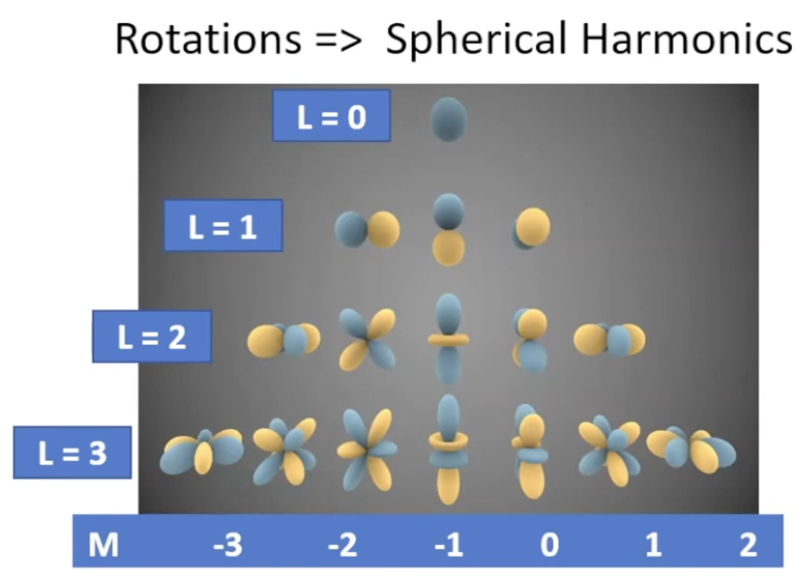
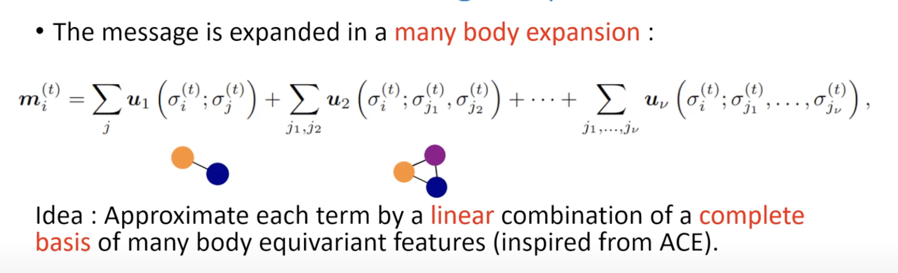
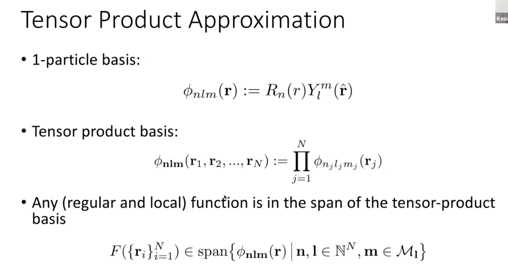

Symmetries in interatomic potentials is a key for accurate potentials. The symmetriees: [translations + rotations] E(3) + permutations.

-  rotations --> spherical haarmoncis

E(3) equivarence is a big thing

- atomic cluster expansion (ACE) which unified many atom density-based descriptors.
- NeiquIP a message passing NN with equivarieant features that showed state of the art perf 

# MACE

the architecture is the following:

- the key operation of mace is the tensor product of the permutation invariant features and symmetrize:

- A

# tensor product approximation

- tensor reduced structure
    - expand as sym of products of rank-1 tensors
    - embdedding channels where we take symmetric tensor from full body structure