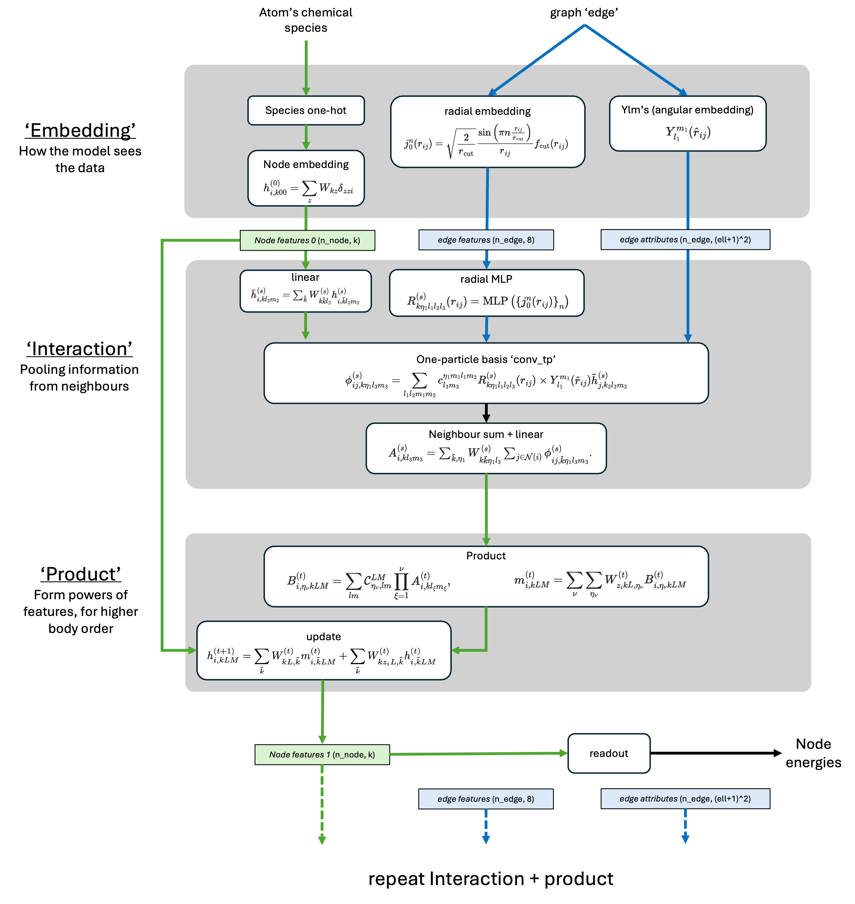

# Shematic MACE

For every stage I also flag **🟢 safe-to-lower-precision** and **🔶 keep-/-accumulate FP32** recommendations.

| #     | Picture label (grey panels & white boxes)                   | Conceptual name (what it does)                                                                 | Mathematical object / operation                                                                  | Low-precision remark                                                                                                                                 |
| ----- | ----------------------------------------------------------- | ---------------------------------------------------------------------------------------------- | ------------------------------------------------------------------------------------------------ | ---------------------------------------------------------------------------------------------------------------------------------------------------- |
| **A** | **Species one-hot → Node embedding** $h^{(0)}_{i,\ell m 0}$ | *Atomic embedding* – converts chemical species to initial **scalar irrep ($\ell=0$) features** | $h^{(0)}_{i,0,0,0}=W_{\text{emb}}\,[\text{one-hot}(Z_i)]$                                        | 🟢 8–16 bit weights & activations are fine (tiny table, no rotations involved).                                                                      |
| **B** | **$\hat g(r_{ij})$** “radial embedding”                     | *Radial Bessel / Gaussian basis* for distances                                                 | $\hat g_n(r)=\sqrt{\tfrac{2}{r_\text{cut}}}\sin\!(\tfrac{n\pi}{r_\text{cut}}r)\,f_\text{cut}(r)$ | 🟢 compute in FP16/BF16; distance itself best kept FP32 to avoid underflow at small $r$.                                                             |
| **C** | **$Y_\ell^m(\hat r_{ij})$** “angular embedding”             | *Real spherical harmonics* (gives angular irreps)                                              | transforms by Wigner-$D^{(\ell)}(R)$                                                             | 🔶  keep in FP32 or cast to FP16 after computation (cheap but numerically sensitive trig).                                                           |
| **D** | **radial MLP** $R_{n\ell m\ell'm'}^{(k)}$                   | Learns environment-dependent **radial filters**                                                | 2-layer MLP with SiLU / tanh                                                                     | 🟢 very compute-heavy → big win from FP16 Tensor Cores.                                                                                              |
| **E** | **“conv\_tp”** (one-particle basis tensor product)          | **Clebsch–Gordan tensor product**: $h_{j}^{(\ell_2)}\otimes Y^{(\ell_1)}\to\phi^{(\ell)}$      | uses CG coeffs $c_{\ell_1 m_1 \ell_2 m_2}^{\ell m}$                                              | 🟢 FP16/BF16 activations; 🔶 store CG tables in FP32 (tiny) to avoid round-off during many re-uses.                                                  |
| **F** | **Neighbour sum + linear** $A^{(\ell)}_{i}$                 | Message *aggregation* (sums over neighbours) plus mixing                                       | $\sum_{j\in\mathcal N(i)} W^{(\ell)}\phi_{ij}^{(\ell)}$                                          | 🟢 messages FP16; 🔶 perform the **sum in FP32** (Kahan or tensor-core “FP32 accumulate” mode) to stop cancellation error for large neighbour lists. |
| **G** | **Product block** $B^{(\theta)}_{i,\ell_1\ell_2\ldots}$     | Builds **higher-body interactions** (powers of order $p$)                                      | repeated CG-tensor products $\prod_{q=1}^{p}\!A^{(\ell_q)}$                                      | 🟢 same rules as E\&F (products FP16, CG coeffs FP32).                                                                                               |
| **H** | **Update** $h^{(t+1)}_{i,\ell m}$                           | Linear + gated non-linearity that writes new node features                                     | gating mixes scalar channel with higher-order irreps                                             | 🟢 FP16 weights & activations; 🔶 keep the *gate bias* in FP32 if tiny values.                                                                       |
| **I** | **Read-out (node energies)**                                | Maps final features → scalar energy contribution                                               | small MLP or linear                                                                              | 🟢 FP16 weights; 🔶 **accumulate the global energy sum in FP32**, same for force autograd.                                                           |

**Green arrows / dashed boxes** in the picture represent **node-feature flow**; the **blue arrows / dashed boxes** are **edge features & attributes**.  All the heavy-tensor-product kernels sit in E + G, which is where the *cuEquivariance* or *EquiTriton* FP16 kernels give the biggest speed-ups.

---

### Quick checklist for a mixed-precision MACE run

| Step | What to cast                                         | How (PyTorch)                                                                  |
| ---- | ---------------------------------------------------- | ------------------------------------------------------------------------------ |
| 1    | Enable AMP context                                   | `with torch.autocast('cuda', dtype=torch.float16):`                            |
| 2    | Keep coordinates & cell FP32/64                      | before passing to model                                                        |
| 3    | Down-cast all learnable layers except read-out sum   | `model.half()` then selectively restore `.float()` for read-out bias if needed |
| 4    | Switch **e3nn** tensor-product ops to cuEquivariance | `e3nn.o3.TensorProduct` → `cueqnn.CGProduct`                                   |
| 5    | Wrap optimiser with `torch.cuda.amp.GradScaler`      | handles loss scaling / unscaling                                               |
| 6    | During inference, turn off scaler                    | just keep the autocast context                                                 |

